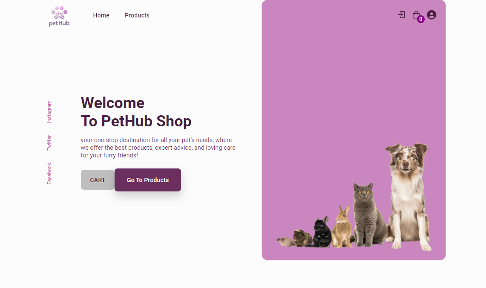
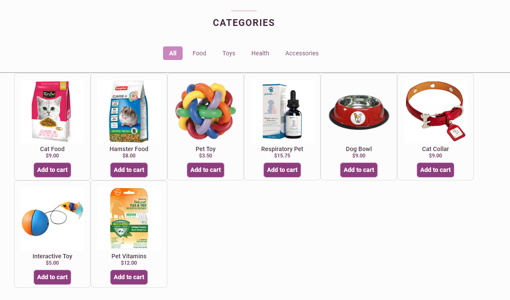
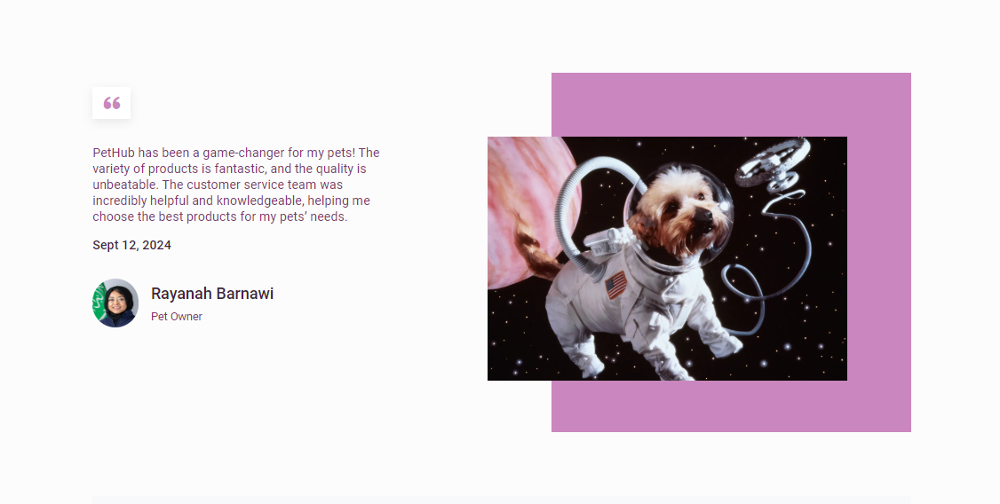
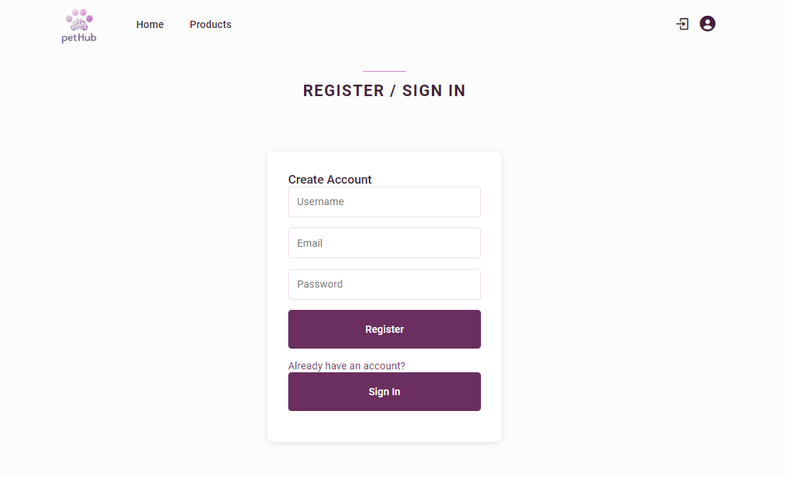

# PETHUB
Welcome to the PETHUB is a web app created for the FOWP course, connecting pet owners with services and resources. It showcases skills in HTML, CSS, and JavaScript, with a focus on responsive design and modern web practices.

## Features
- **Pet Shop:** Browse and purchase pet supplies and accessories.
- **Service Directory:** Discover pet care services like grooming and veterinary clinics.

## Usage
- **Shop for Pets:** Explore the shop to find and buy pet essentials.
- **Find Services:** Search for trusted pet care services nearby.
  
## Screenshots

<div style="display: flex; gap: 10px;">
  
  
  
  
</div>

## Contributing
If you want to contribute to this project, feel free to open issues or submit pull requests. Your feedback and contributions are highly appreciated!

## Contact
For any questions or feedback, you can reach out to me at [Hissah.khalid@hotmail.com](mailto:Hissah.khalid@hotmail.com). 

## License
 ```bash
  Copyright 2024 Hissah Khalid and Rana Alzafar and Majd Almubarak.
